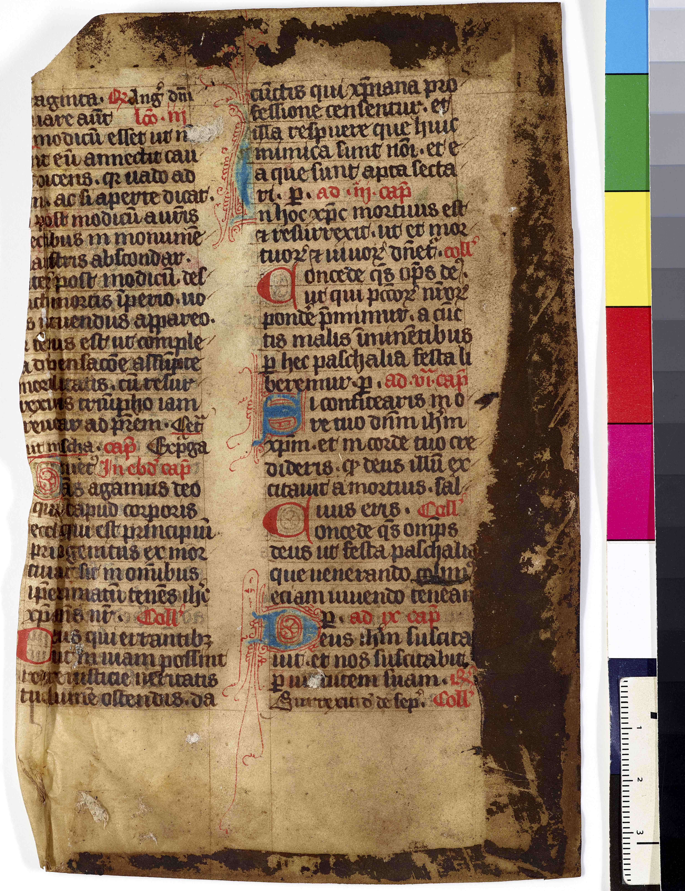
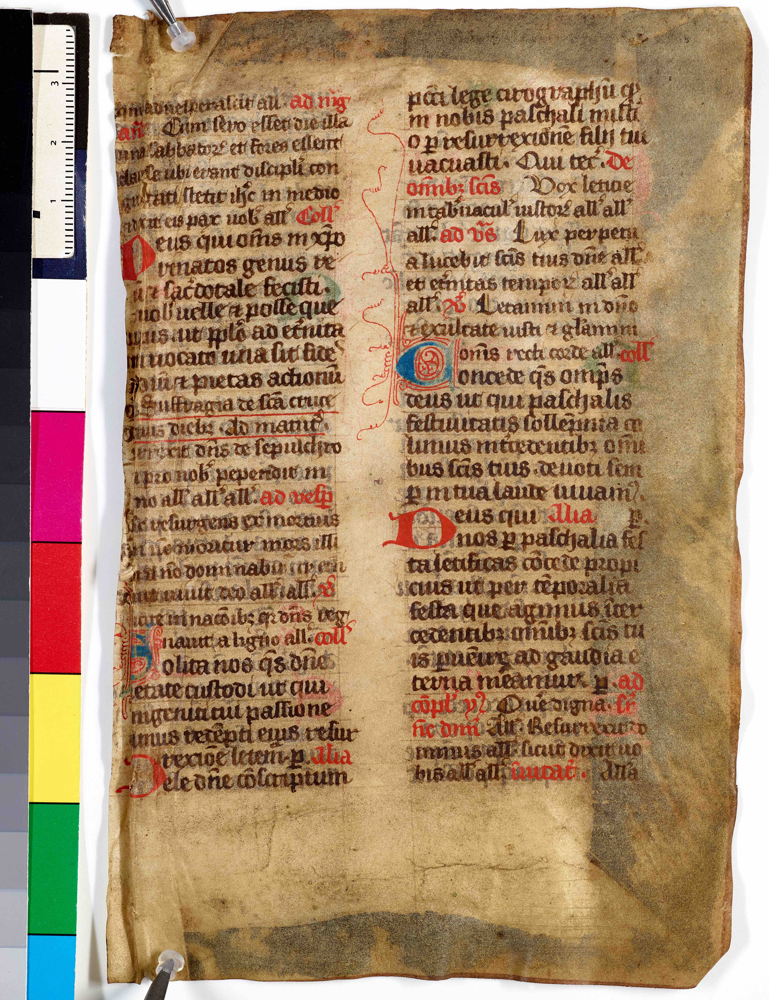
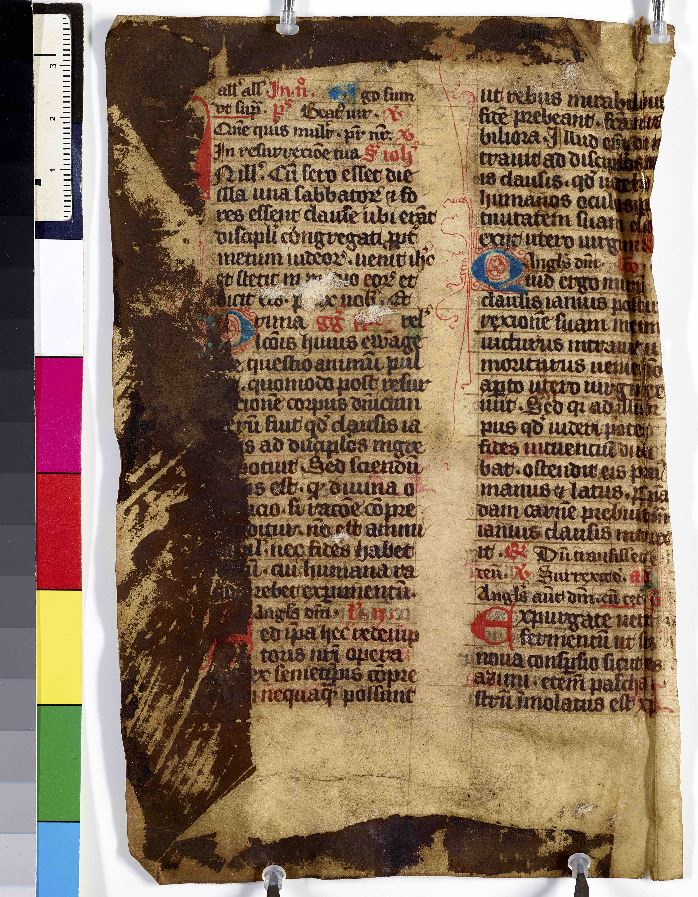
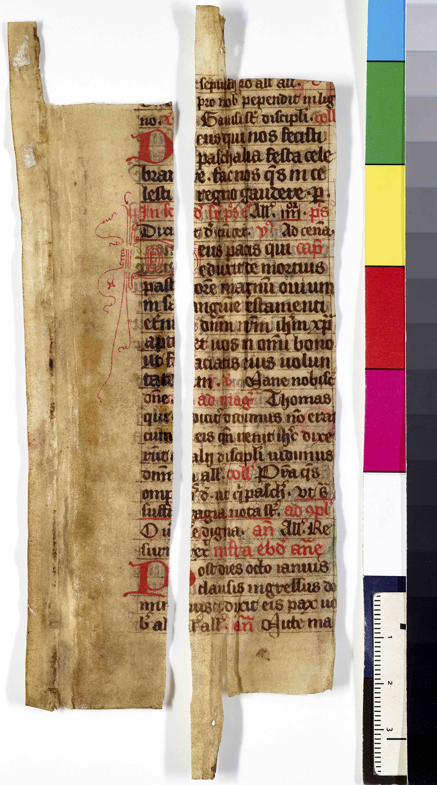
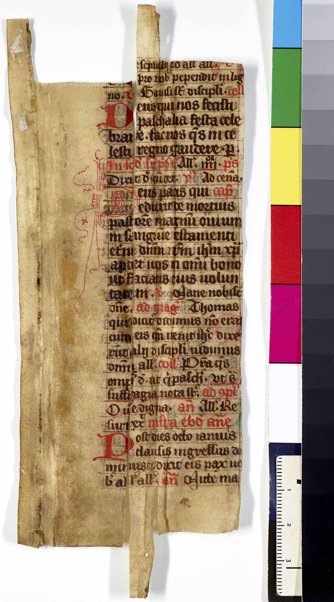
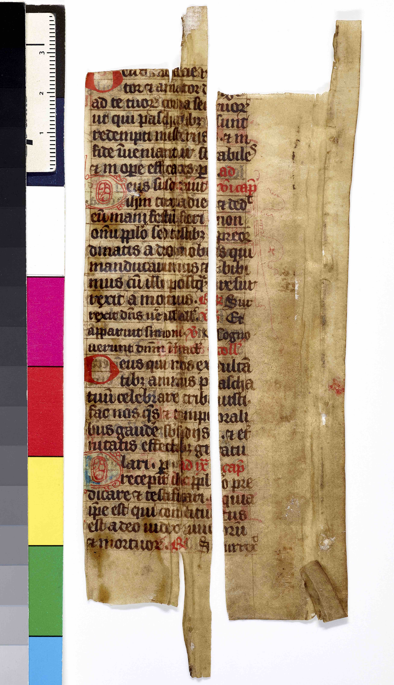
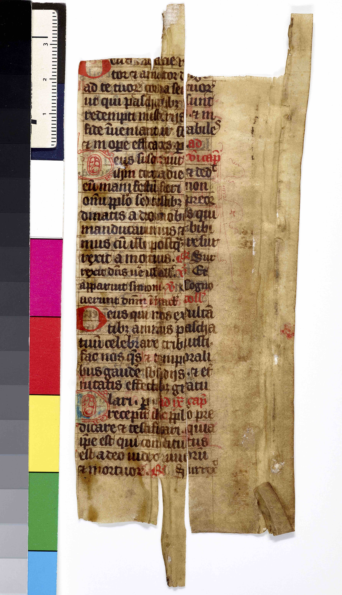

## Fragmenter af latinsk missale vedrørende påsken

### Call number: RARA Fragmenter Pakke 1

Sparse information: Medieval parchment fragments of a Latin missal, specifically on Easter. Among other things, there are references to John 20:19. Otherwise, unidentified. Dating?

In the 1970ies, the fragments were removed from the binding of: Diogenous Laertou Peri biōn, dogmatōn kai apophthegmatōn tōn en philosophia eudokimēsantōn, biblia 10 Cum annotationibus Henr.Stephani Diogenis Laertii De vitis, dogmatis & apophthegmatis eorum qui in philosophia claruerunt, libri X 
1570, call number: RARA K 230

[back to home](README.md)
